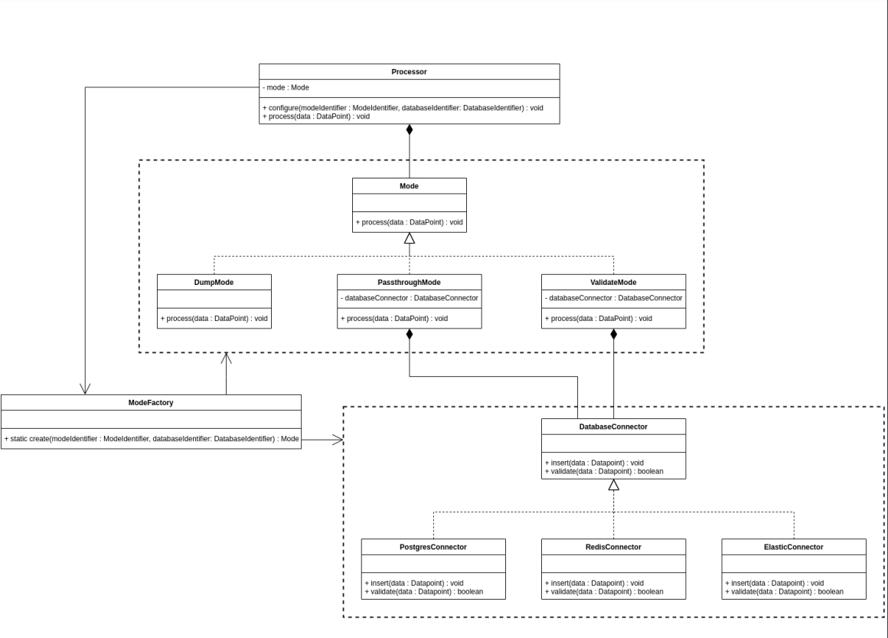
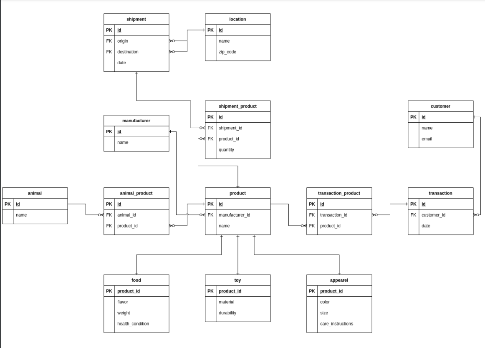

# Wallmart Software Engineering Virtual Internship

## Task 1

- The Walmart Shipping Department is implementing a new system which depends on a priority queue.
- Since the queue represents a potential bottleneck in the system, much thought is being put into selecting the right data structure for the job.
- Many options have been proposed, and the plan is to benchmark each one in order to pick the best option.
- Your task is to implement one of the proposed data structures: a slightly modified heap.
- The heap must satisfy the heap property, but rather than a traditional binary heap, each parent node in this heap will have 2^x children.
- Since the goal is to benchmark the most common operations on the data structure, you will only be responsible for implementing two methods - insert,  and pop max.
- Think carefully about what parts of the heap need to change, and how those changes will affect the rest of the heap’s behavior.

Your task is to implement a novel data structure - your project lead is calling it a power of two max heap. The rest of your team is doing their best to come up with a better name. The requirements of the data structure are as follows:

- The heap must satisfy the heap property.
- Every parent node in the heap must have 2^x children.
- The value of x must be a parameter of the heap’s constructor.
- The heap must implement an insert method.
- The heap must implement a pop max method.
- The heap must be implemented in Java.
- The heap must be performant.
- You must use a more descriptive variable name than x in your implementation.

Sample Answer

```
import java.util.ArrayList;

public class Heap<T extends Comparable<T>> {
    private final int childCount;
    private final ArrayList<T> data;
    public Heap(int childCount) {
    this.validateChildCount(childCount);
    this.childCount = childCount;
    this.data = new ArrayList<T>();
}
private void validateChildCount(int childCount) {
    // ensure childCount is valid
    // ensure childCount is greater than zero
    if (childCount <= 0) {
    throw new IllegalArgumentException("childCount must be greater than zero");
}

// ensure childCount is a power of 2
double logChildCount = Math.log(childCount) / Math.log(2);
    if (Math.ceil(logChildCount) != Math.floor(logChildCount)) {
    throw new IllegalArgumentException("childCount must be a power of 2");
    }
}
public void insert(T item) {
    // insert an item into the heap
    data.add(item);
    int itemIndex = data.size() - 1;
    while (itemIndex > 0) {
    itemIndex = this.swapUp(itemIndex);
    }
}
private int swapUp(int childIndex) {
    // check a child against its parent, and swap it if necessary to satisfy heap property
    T childValue = data.get(childIndex);
    int parentIndex = (int) Math.floor((float) (childIndex - 1) / childCount);
    if (parentIndex >= 0) {
    T parentValue = data.get(parentIndex);
    if (childValue.compareTo(parentValue) > 0) {
    data.set(parentIndex, childValue);
    data.set(childIndex, parentValue);
    return parentIndex;
    }
}
return -1;
}
public T popMax() {
    // pop the max value off the heap, return null if none remain
    if (data.size() > 0) {
    T maxItem = data.get(0);
    if (data.size() > 1) {
    T lastItem = data.remove(data.size() - 1);
    data.set(0, lastItem);
    int itemIndex = 0;
    while (itemIndex >= 0) {
    itemIndex = this.swapDown(itemIndex);
    }
}
return maxItem;
} else {
    return null;
}
}
private int swapDown(int parentIndex) {
    // check a parent against all children and swap it with the highest child if necessary to satisfy heap property
    T parentValue = data.get(parentIndex);
    // determine largest child
    int largestChildIndex = 0;
    T largestChildValue = null;
        for (int i = 0; i < childCount; i++) {
        int childIndex = childCount * parentIndex + i + 1;
        if (childIndex < data.size() - 1) {
        T childValue = data.get(childIndex);
        if (largestChildValue == null || childValue.compareTo(largestChildValue) > 0) {
        largestChildIndex = childIndex;
        largestChildValue = childValue;
        }
    }
}
// perform swap if necessary
if (largestChildValue != null && parentValue.compareTo(largestChildValue) < 0) {
        data.set(parentIndex, largestChildValue);
        data.set(largestChildIndex, parentValue);
        return largestChildIndex;
        }
    return -1;
    }
}
```

Implementation of a generic heap data structure with a specified child count. The heap maintains the property that each parent node is greater than or equal to its child nodes. It provides methods for inserting items into the heap and popping the maximum value off the heap.

### `Class Definition:`

`public class Heap<T extends Comparable<T>> {`

This defines a generic class Heap that takes a type parameter T which must be comparable. This allows the heap to store elements of any type that can be compared to each other.

`public Heap(int childCount) {`

The constructor takes an integer childCount which specifies the number of children each node in the heap will have. It validates the child count and initializes the data structure.

### `Data Structure:`

`private final ArrayList<T> data;`

The heap stores its elements in an ArrayList named data. This allows for efficient insertion and removal of elements.

### `Inserting Items:`

`public void insert(T item) {`

The insert method adds a new item to the heap. It appends the item to the data list and then calls swapUp to maintain the heap property.

### `Swapping Up:`

`private int swapUp(int childIndex) {`

The swapUp method checks a child node against its parent and swaps them if necessary to satisfy the heap property. It returns the index of the parent if a swap occurred, or -1 if no swap was needed.

### `Popping Maximum Value:`

`public T popMax() { `

The popMax method removes and returns the maximum value from the heap. It swaps the last element with the root, removes the last element, and then calls swapDown to maintain the heap property.

### `Swapping Down:`

`private int swapDown(int parentIndex) { `

The swapDown method checks a parent node against its children and swaps it with the largest child if necessary to satisfy the heap property. It returns the index of the largest child if a swap occurred, or -1 if no swap was needed.

# Task 2

### Background Info

After much deliberation amongst your team, you have been trusted to design part of a new data processing pipeline. You will be responsible for coming up with the architecture for a dynamically reconfigurable data processor. The processor will have several different modes, each of which treats incoming data in a different way. Some modes will pass the result along to a database, and others will additionally validate the data against the database. To further complicate matters, there are several databases in play, and the processor needs the ability to toggle between them on the fly. The system needs to be extendable - your team has every intention of adding additional modes and databases in the future - so take extra care to ensure the system isn’t rigid. Adhere to good design principles, use design patterns where they make sense, and remember your SOLID principles.

### Task

Your task is to draft a UML class diagram describing the data processors for a pipeline. The component responsible for reading in input data is being designed by another engineer, so you only need to worry about what happens to the data when it reaches your processor. You may assume three classes already exist:

Datapoint: this class represents both raw and processed data points. Any time data moves between methods you may use this class as an abstraction.
ModeIdentifier: an enum used to identify a processor mode.
DatabaseIdentifier: an enum used to identify a database connection.

Here are the requirements for your design:

- The processor must implement a configure method that accepts a ModeIdentifier and a DatabaseIdentifier as parameters.
    - This method is called to change the operating mode of the processor, and/or select the current database.
- The processor must be able to change between the following modes:
    - Dump mode: simply drops the data.
    - Passthrough mode: inserts the data into the currently configured database.
    - Validate mode: validates the data, then inserts it (both operations are carried out on the currently configured database).
- The processor must be able to swap between the following databases. Each database will require a different implementation to insert and validate data
    - Postgres.
    - Redis.
    - Elastic.
- The processor must implement a process method that accepts a DataPoint as a parameter.
    - This method will have different behavior depending on the currently configured mode and database.



# Task 3

The Walmart pet department has decided to combine its numerous databases into a single source of truth. The centralized database will save much time and effort when it comes to querying the data and collecting metrics. They just got approval to begin the project, so now it’s up to your team to begin putting the database together. The first step is to figure out the database schema. You have been selected to design the database, and are expected to have the first draft of an ERD completed shortly. The pet department has sent over a list of requirements the design must satisfy and are eager to get started. Good luck!

### Task Info

Your task is to draft a UML class diagram describing the data processors for a pipeline. The component responsible for reading in input data is being designed by another engineer, so you only need to worry about what happens to the data when it reaches your processor.

`You may assume three classes already exist:`

- Datapoint: this class represents both raw and processed data points. Any time data moves between methods you may use this class as an abstraction.
- ModeIdentifier: an enum used to identify a processor mode.
- DatabaseIdentifier: an enum used to identify a database connection.

`Your task is to draft an ERD for an appropriately normalized relational database that satisfies these requirements:`
- The database should store information related to the following products.
    - Pet food, which has a name, manufacturer, weight, flavor, and target health condition.
    - Pet toys, which have an associated material, name, manufacturer, and durability.
    - Pet apparel, which has a color, manufacturer, size, name, and specific care instructions.

- Each product should be associated with one or more animals.

- Each product should be associated with a manufacturer.


- The database should track customers and their transactions.
    - It should store customer names and email addresses.
    - Customers can make transactions to purchase one or more products.
    - Each transaction should store the date and the products involved.

- The database should track shipments to various Walmart locations.
    - Each location should be represented by a name and a zip code.
    - A shipment is recorded as an origin, a destination, and a collection of products, each with an associated quantity.


